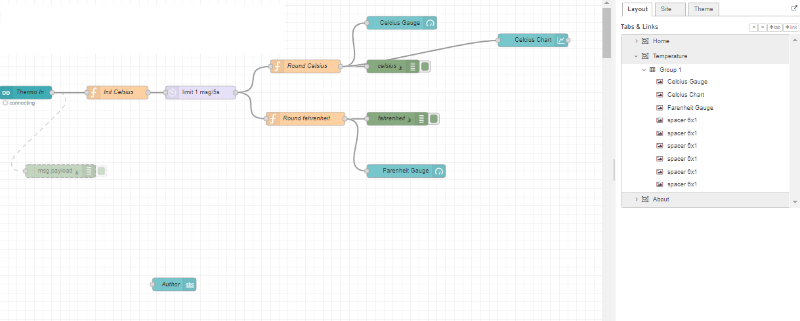
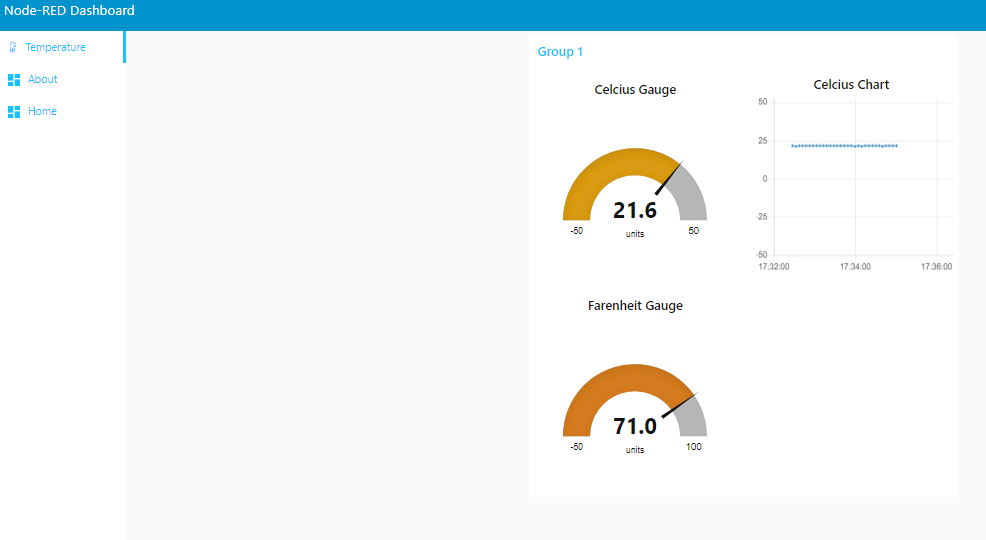

# Using Thermoresister & Node-Red to track temperature

Using Node-Reds built in dashboard Track the temperature of a room.  
    - Json Flow File 
    - Image of Flow 
    - Image of Dashboard Displaying Temperatures 
<h3> Image of Flow</h3>

<h3> Image of Temperature DashBoard</h3>

