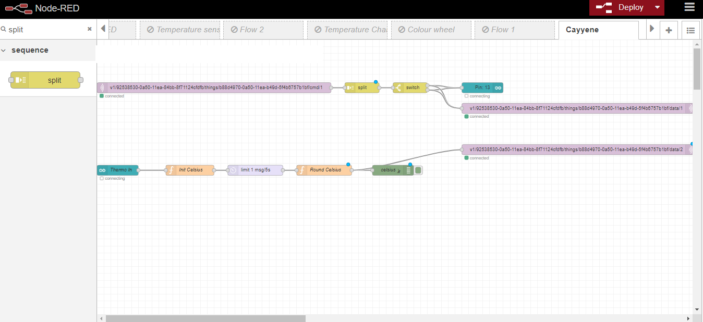
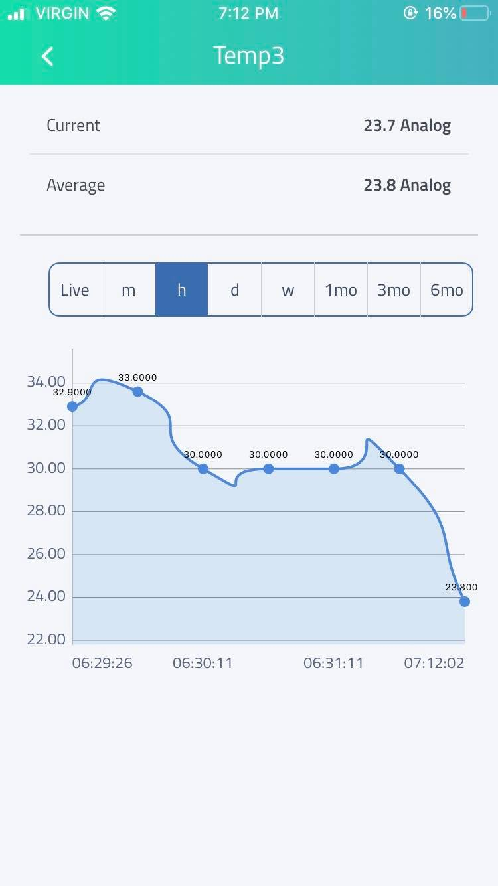

# Using Node-Red & Cayenne MQTT to track temperature or a light

Using Node-Reds MQTT Functions to connect to mobile device with Cayenne  
    - Json Flow File 
    - Image of Flow 
    - Image of Cayenne Desktop  
    - Images of Cayenne Mobile  

<h3> Image of Flow</h3>

<h3> Image of Cayenne Desktop DashBoard</h3>

<h3> Images of Cayenne Mobile DashBoard</h3>

 